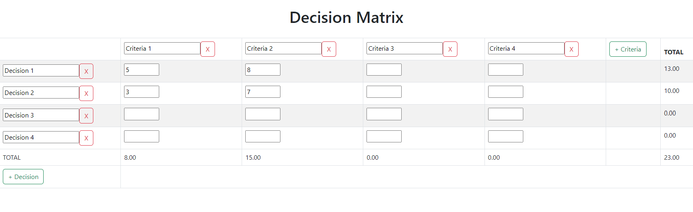

# Multi Criteria Decision Analysis Matrix
This repository contains a Multi Criteria Decision Analysis (MCDA) Matrix tool that allows users to compare and evaluate different options based on multiple criteria. The MCDA Matrix can be used for a variety of decision-making purposes, such as product selection, project prioritization, or anything you like.

## How to Use the Tool
The MCDA Matrix tool consists of a template that users can customize according to their specific needs. The template includes several sheets that guide users through the process of defining the decision problem, identifying the criteria and alternatives, assigning weights and scores to each criterion, and calculating the overall scores for each alternative.

## To use the tool, follow these steps:
1. Start by customizing the criteria and decisions according to your decision problem., or simply choose a template.

2. Assign weights and scores to each criterion based on their relative importance and performance from 1 to 10, respectively.

3. That’s it! The results are immediately updated.

## License
The MCDA Matrix tool is licensed under the MIT License, which allows users to freely use, modify, and distribute the tool as long as they include the original copyright notice and disclaimer. By using this tool, you agree to abide by the terms of this license.